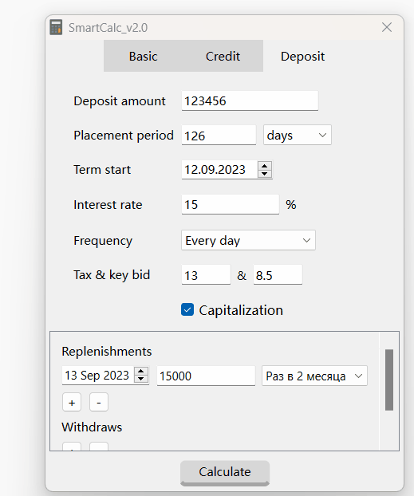

# SmartCalc
Basic math, credit and deposit calculator implementation in app based on QT framework.

## Brief

The basic principle of calculations is implemented on the basis of Dijkstra's algorithm, the essence of which is to convert mathematical expressions from infix notation to reverse Polish notation.

  

The calculator implements the possibility of plotting functions and equation mode(with x as variable).

  
  

The calculator has a special mode of operation: Credit Calculator.It is written following the example of a calculator on the calcus website. Calculates values with the same accuracy to a penny as on the calcus calculator.
The loan calculator window contains the following fields:
- Loan amount - the desired loan amount. Specified as an integer or a floating-point number.
- Loan term - set in months, supports only integer values.
- Interest rate - the desired interest rate. Specified as an integer or a floating-point number.
- Type of monthly payments - type of calculation of monthly payments.
Output fields:
- Monthly loan payment.
- Accrued interest.
- Debt + interest.
- A table with payments and payment dates.

  

The calculator has a special mode of operation: Deposit Calculator. It is written following the example of a calculator on the calcus website. Calculates values with the same accuracy to a penny as on the calcus calculator.
The deposit calculator window contains the following fields:
- Deposit amount - the initial deposit amount. Specified as an integer or a floating-point number.
- Placement period - for how long you plan to invest money. It is set in months, years or days depending on the selection from the drop-down list.
- The beginning of the term.
- The interest rate is the percentage at which you invest money. Specified as an integer or a floating-point number.
- Frequency of payments - frequency of interest accrual (selected from the drop-down list).
- Capitalization of interest - activate the checkbox if interest is credited to the account.
- Deposits - the frequency of replenishment of the account. Set as an integer. Click on '+' to add a popolenie, '-' to remove.
- Write-offs - frequency of partial

  

